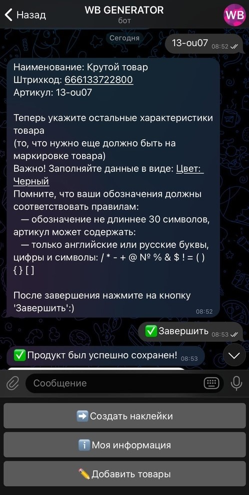
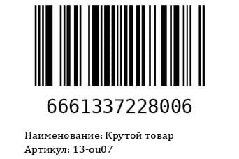

# Wildberries генератор штрихкодов

Данный бот генерирует маркировку товара (штрихкод + описание) и генерирует этикетки (маркировка+клиентский штрихкод) для удобной печати (результат отправляется в .docx)

Посмотреть на бота в действии вы можете здесь: [@wbgen_bot](https://wbgen_bot.t.me/)
---
Примеры:
Создание аккаунта             |  Добавление товара | Результат (после добавления товара)
:-------------------------:|:-------------------------:|:-------------------------:
 |  |  
| | | (без примера с клиентским штрихкодом, конфидециальность все дела


Написан на aiogram 

Необходимая версия Python ```3.10+```
